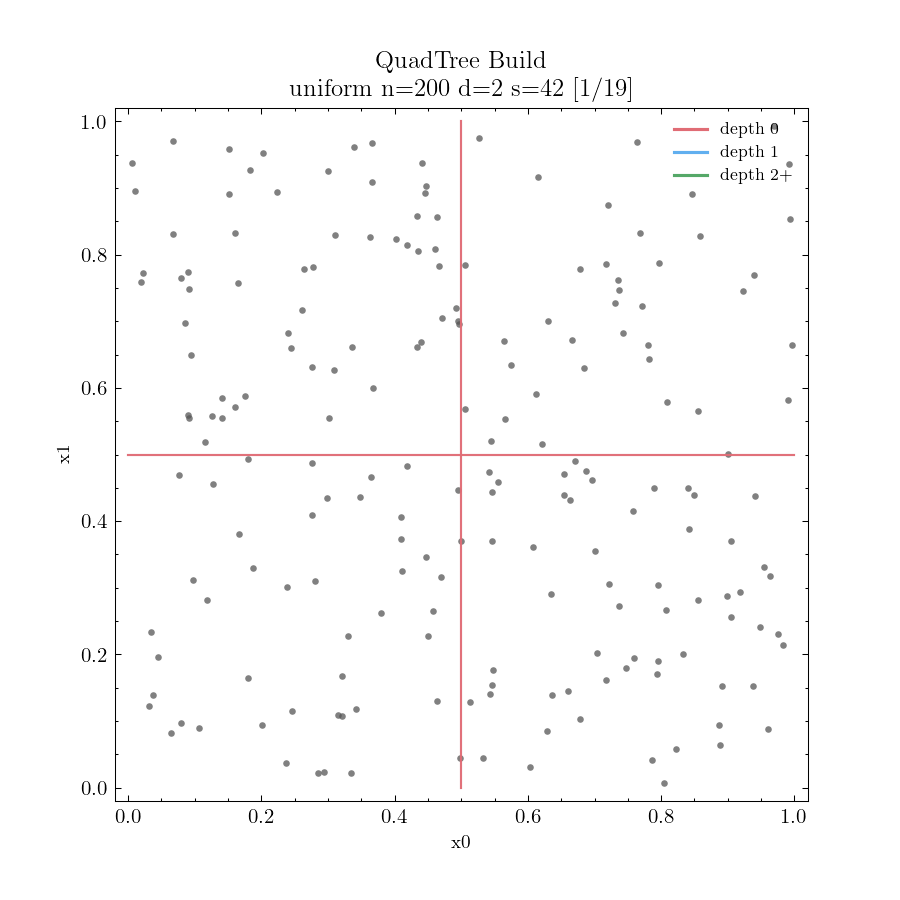
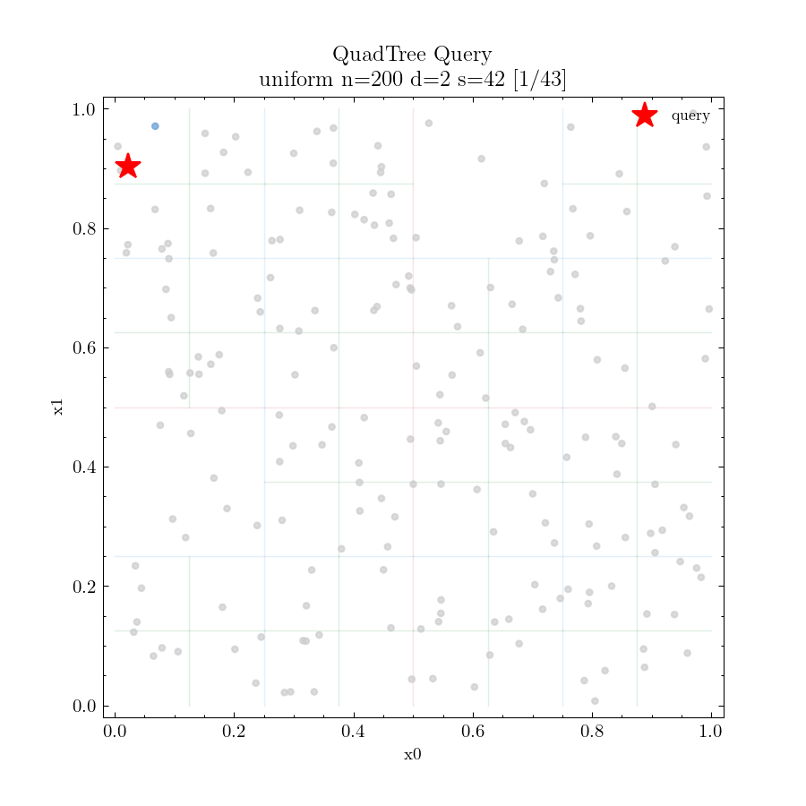
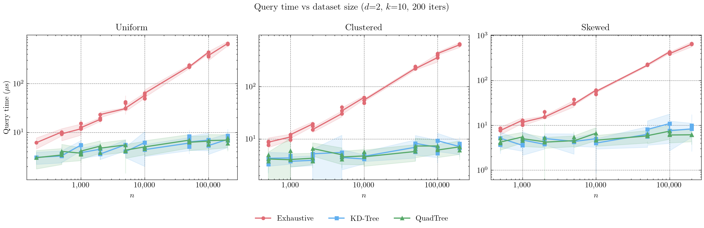
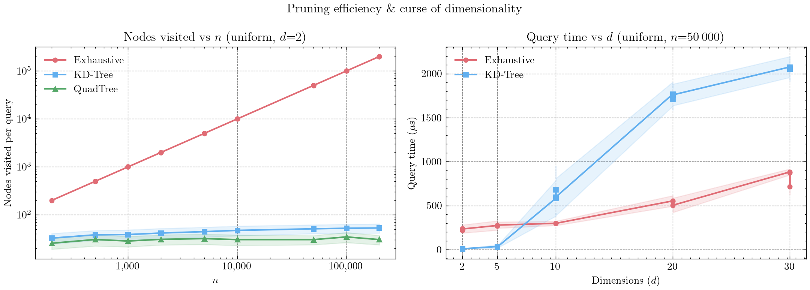

# NNS-Trees

> Benchmarking spatial index structures for exact k-nearest-neighbour search —
> KD-Tree and QuadTree against an exhaustive baseline — with animated build and query traversal.

<p align="center">
  
  
</p>
<p align="center">
  
  
</p>
<p align="center"><em>KD-Tree (top) and QuadTree (bottom) — build and query on uniform n=200, d=2</em></p>

---

## Overview

The project measures how much spatial partitioning helps for exact k-NN as dataset size and
dimensionality grow. Three algorithms share a common `NNSIndex` interface and are evaluated
against three point distributions (uniform, clustered, skewed) across n up to 200 000 and
d up to 30.

Key findings are captured in two experiments:

- **n-scaling** — both tree structures achieve ~90× speedup over exhaustive at n=200 000 (d=2),
  visiting ≤ 0.03% of the dataset per query.
- **d-scaling** — KD-Tree is fastest up to d≈8, then degrades sharply; it is 4× *slower* than
  exhaustive at d=30 due to the curse of dimensionality.

---

## Implementation

### Structure

```
source/
├── generic/
│   ├── types.hh          # Point, Points, Neighbour, QueryResult
│   ├── index.hh          # NNSIndex abstract base (build + query)
│   ├── functions.hh      # squared L2 norm
│   └── logger.hh         # compile-time event logger (zero cost in release)
├── exhaustive_knn/
│   └── exhaustive_knn.hh
├── kd_tree/
│   └── kd_tree.hh
├── quad_tree/
│   └── quad_tree.hh
├── benchmark/
│   ├── benchmark.cc      # single TU; CLI entry point
│   └── benchmark.hh      # timing, stats, neighbours output
├── data_gen.py           # synthetic dataset generator
├── visualize.py          # scatter plots + build/query animations
└── benchmark_plot.py     # result plots from stats CSVs
```

### Algorithms

All three implement the same interface:

```cpp
class NNSIndex {
public:
    virtual void        build(PointsPtr aPoints) = 0;
    virtual QueryResult query(const Point &aQ, size_t aK) const = 0;
};
```

| Algorithm | Split rule | Pruning rule | Dims |
|:--|:--|:--|:--|
| `ExhaustiveKNN` | — | none | any |
| `KDTree` | median of highest-variance axis (`nth_element`) | hyperplane distance > heap worst | any |
| `QuadTree` | geometric midpoint → 4 equal quadrants | box distance > heap worst | 2 only |

Both trees visit children in order of increasing box distance.

### Logger

A compile-time–switched event emitter (`ENABLE_LOGGING` CMake flag).
All calls optimise away in release builds (`if constexpr`).
The `logging` preset enables it at release optimisation level; `--iters 1` produces
a single-query log that `visualize.py` turns into a frame-by-frame animation.

```cpp
Logger::splitKD(idx, axis, depth, lo, hi);  // KD-Tree build: new partition line
Logger::splitQuad(depth, lo, hi);            // QuadTree build: new cross
Logger::pruneKD(idx, distSq);               // query: subtree skipped
Logger::pruneQuad(distSq, lo, hi);          // query: quadrant skipped
Logger::visit(idx);  Logger::accept(...);   Logger::evict(...);
```

---

## Results

### Query time vs n — d=2, k=10, 200 iterations



| n | Exhaustive | KD-Tree | QuadTree | KD speedup | Quad speedup |
|--:|--:|--:|--:|--:|--:|
| 1 000 | ~13 μs | ~4 μs | ~4 μs | 3× | 3× |
| 10 000 | ~52 μs | ~5 μs | ~5 μs | 10× | 10× |
| 100 000 | ~390 μs | ~7 μs | ~7 μs | 56× | 56× |
| 200 000 | ~648 μs | ~7.5 μs | ~7.0 μs | **86×** | **93×** |

### Pruning efficiency & curse of dimensionality



Nodes visited per query at n=200 000, d=2, uniform:

| Algorithm | Nodes visited | % of dataset |
|:--|--:|--:|
| Exhaustive | 200 000 | 100% |
| KD-Tree | ~53 | 0.03% |
| QuadTree | ~31 | 0.02% |

KD-Tree crossover with exhaustive occurs around **d=8–10**; at d=20+ it visits the
entire dataset and is 3–4× slower than exhaustive due to tree traversal overhead.

### Effect of distribution — n=200 000, d=2

| Distribution | Exhaustive | KD-Tree | QuadTree |
|:--|--:|--:|--:|
| Uniform | ~645 μs | ~7.5 μs | ~7.0 μs |
| Clustered | ~643 μs | ~7.3 μs | ~6.7 μs |
| Skewed | ~652 μs | ~9.1 μs | ~6.1 μs |

QuadTree is unaffected by skewed data — geometric midpoint splits isolate the dense
corner quickly. KD-Tree degrades slightly as median splits become unbalanced.

---

## Reproducibility

### Prerequisites

| Tool | Purpose |
|:--|:--|
| CMake ≥ 3.20, Make | Build system |
| GCC / Clang (C++20) | Compiler |
| Python ≥ 3.12, `uv` | Data generation, visualisation, plotting |

```bash
uv sync                          # install numpy, matplotlib, scienceplots, pandas
uv tool install black isort      # needed for the pre-commit hook
git config core.hooksPath hooks  # activate clang-format + black on commit
```

### Run the full sweep

```bash
./sweep.sh              # build both presets, generate data, run all experiments, plot
./sweep.sh --skip-build # skip cmake if already built
```

`sweep.sh` runs in order:

1. Builds `release` and `logging` CMake presets
2. Generates all missing datasets via `data_gen.py`
3. **Correctness check** — runs all three algos on a small dataset, diffs neighbour index columns
4. **Experiment 1** — n-scaling (d=2, n: 500→200 000, all algos × all distributions)
5. **Experiment 2** — d-scaling (uniform, n=50 000, d: 2→30, exhaustive vs. KD-Tree)
6. Saves viz logs (n=200, d=2, logging build) for each algo × distribution
7. Runs `benchmark_plot.py --save` → `assets/figures/`

### Manual steps

```bash
# Single benchmark run
./build/release/benchmark --data uniform_n50000_d2_s42.csv \
    --algo kdtree --k 10 --iters 200

# Generate a visualisation log and animate it
./build/logging/benchmark --data uniform_n200_d2_s42.csv \
    --algo quadtree --k 10 --iters 1
uv run python source/visualize.py animate \
    --log  assets/output/logs/quadtree_uniform_n200_d2_s42.log \
    --data data/uniform_n200_d2_s42.csv \
    --mode both --save

# Replot from existing stats
uv run python source/benchmark_plot.py --save
```

Stats CSVs accumulate in `assets/output/stats/<algo>_<dist>_stats.csv`,
logs in `assets/output/logs/`, figures in `assets/figures/`.
