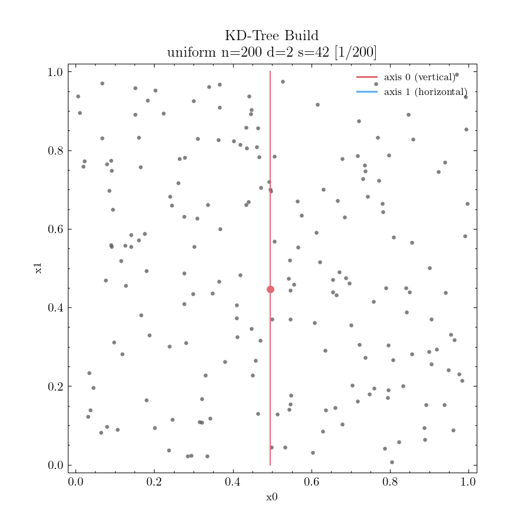
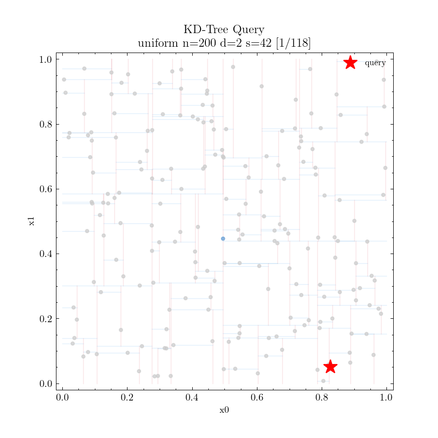
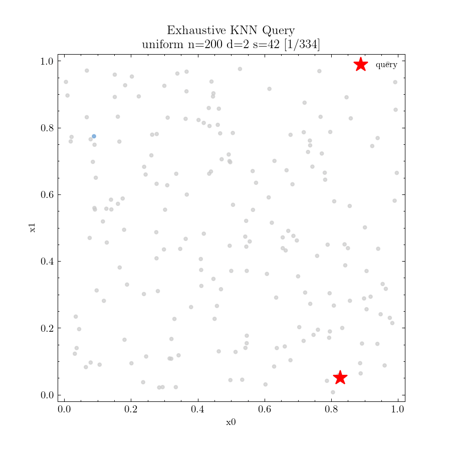

# NNS-Trees — Project Status

> Branch `dev-kolya` · 2026-05-22

---

## Development Setup

### Git hooks (one-time, per clone)

Pre-commit hooks for auto-formatting are tracked in [`hooks/`](hooks/).
After cloning, activate them with:

```bash
git config core.hooksPath hooks
```

The hook runs automatically on every `git commit`:
- **C/C++** (`.cc .cpp .cxx .hh .h .hpp`) — `clang-format` using [`.clang-format`](.clang-format)
- **Python** (`.py`) — `isort` then `black`

Required tools: `clang-format` (system), `black` and `isort` via `uv tool install black isort`.

---

## 1. Data Selection and Generation

All datasets are synthetically generated by [source/data_gen.py](source/data_gen.py),
a self-contained Python script backed by NumPy. Three distributions are implemented via an
extensible `DataGenerator` ABC (registry pattern; new generators register automatically at
import time):

| Distribution | Description | Stress target |
|---|---|---|
| **Uniform** | Points drawn i.i.d. from $U([0,1]^d)$ | Clean asymptotic baseline |
| **Clustered** | $k$ Gaussian blobs with centres in $[0.1,\,0.9]^d$; std $\sigma = 0.05$ (configurable); points clipped to unit box and shuffled | Spatial-midpoint tree partitioning (QuadTree) |
| **Skewed** | All points concentrated in $[0,\,f]^d$ where $f = 0.1$ (configurable) | Worst-case for spatial-midpoint splits |

**Output format:** headerless CSV, one point per row, `d` comma-separated `float32` columns
(6 decimal places), auto-named `data/<dist>_n<n>_d<dims>_s<seed>.csv`.

**Reproducibility:** every run takes an explicit `--seed` (default 42) passed to
`np.random.default_rng`, so any dataset can be regenerated bit-for-bit.

**Pre-generated datasets** (committed to `data/`):

```
uniform_n2000_d2_s42.csv    2 000 pts, 2-D
clustered_n2000_d2_s42.csv  2 000 pts, 2-D, 5 clusters, σ=0.05
skewed_n2000_d2_s42.csv     2 000 pts, 2-D, f=0.10
```

The generator supports arbitrary dimensionality (`--dims`) which will be used for the
KD-Tree dimensionality-degradation sweep.

---

## 2. Baseline Algorithm — Exhaustive KNN

**Class:** `ExhaustiveKNN` ([source/exhaustive_knn/exhaustive_knn.hh](source/exhaustive_knn/exhaustive_knn.hh)) — header-only.

**Interface** (shared by all NNS implementations, [source/generic/index.hh](source/generic/index.hh)):

```cpp
class NNSIndex {
    virtual void        build(PointsPtr aPoints) = 0;
    virtual QueryResult query(const Point &aQ, size_t aK) const = 0;
protected:
    PointsPtr points;
};

struct QueryResult {
    Neighbours neighbours;   // sorted ascending by L2 distance
    size_t     nodesVisited;
};
```

**Core types** ([source/generic/types.hh](source/generic/types.hh)):
- `Point = std::vector<float>` — a single d-dimensional point
- `Points = std::vector<Point>`, owned via `shared_ptr<Points>`
- `Neighbour { float dist; size_t idx; }` — one result entry (max-heap ordered by dist)

**Algorithm:**

1. `build()` — O(1); stores a shared pointer to the dataset (zero-copy).
2. `query(q, k)` — O(n log k) linear scan:
   - Maintains a `std::priority_queue<Neighbour>` (max-heap) of capacity k.
   - Distance metric is **squared L2** (inline `L2norm` in `functions.hh`) to avoid
     `sqrt` on every comparison — `sqrt` is taken only for the k final winners.
   - After the scan, results are extracted from the heap, distances converted to true
     L2, and sorted ascending before returning.

`ExhaustiveKNN` provides exact answers and is the correctness reference against which
KD-Tree and QuadTree results will be verified.

---

## 3. Benchmark Pipeline

The benchmark harness is in [source/benchmark/benchmark.cc](source/benchmark/benchmark.cc).

```
data/<dist>_n<n>_d<dims>_s<seed>.csv  →  benchmark binary  →  assets/output/
```

**Usage:**

```bash
./build/release/benchmark --data <filename> --algo <name> [options]

  --data <filename>     CSV filename relative to DATA_DIR
  --algo <name>         Algorithm name (exhaustive, kdtree, ...)
  --k <int>             Number of neighbours (default: 5)
  --iters <int>         Number of query iterations (default: 100)
  --noise <float>       Gaussian noise added to query points (default: 0.01)
  --seed <int>          RNG seed (default: 42)
  --save-neighbours     Also write per-query neighbour CSV
```

**Query points** are sampled by picking a random dataset point and adding per-dimension
Gaussian noise $\mathcal{N}(0, \texttt{noise})$, clamped to $[0, 1]^d$.

**Outputs** (written to `assets/output/`):

| File | Contents |
|---|---|
| `<algo>_<stem>_stats.csv` | Build time, mean/std query time, mean/std nodes visited |
| `<algo>_<stem>_neighbours.csv` | Query point (idx = −1) followed by k neighbours per iteration |
| `logs/<algo>_<stem>.log` | Full event log — only produced under the `logging` CMake preset |

Because the CSV schema is fixed (headerless, float32 rows) and dimensionality is
self-describing, **adding a new dataset requires only running `data_gen.py`** — the
benchmark binary needs no changes.

---

## Current Status

### Algorithms

| Algorithm | Build | Query | Notes |
|---|---|---|---|
| `ExhaustiveKNN` | ✅ | ✅ | Linear scan, max-heap; correctness reference |
| `KDTree` | ✅ | ✅ | Median split via `nth_element`, pruning by hyperplane distance |
| `QuadTree` | 🔲 | 🔲 | Not yet started |

### Infrastructure

| Component | Status | Notes |
|---|---|---|
| `NNSIndex` interface | ✅ | `build(PointsPtr)` + `query(Point, k) → QueryResult` |
| `Benchmark` harness | ✅ | Timed build/query, CSV stats + neighbours output |
| Compile-time `Logger` | ✅ | Zero overhead in `release`; enabled via `logging` CMake preset |
| CMake presets | ✅ | `release`, `debug`, `logging` — separate `build/<preset>/` dirs |
| Data generator | ✅ | Uniform / Clustered / Skewed, arbitrary `n`/`d`/seed |
| Git hooks | ✅ | `clang-format` + `black` + `isort` on commit (`hooks/pre-commit`) |

### Visualiser ([source/visualize.py](source/visualize.py))

| Feature | Status | Notes |
|---|---|---|
| Dataset scatter plots | ✅ | `scatter` subcommand, multi-file side-by-side |
| KD-Tree build animation | ✅ | Partition lines coloured by split axis (red = x, blue = y) |
| KD-Tree query animation | ✅ | Visited / accepted / evicted / result point states; acceptance radius circle; pruned cells shaded |
| Exhaustive KNN query animation | ✅ | Same event model as KD-Tree query |
| Save to `assets/figures/` | ✅ | `--save` flag; filenames derived from log stem + stage |
| QuadTree animation | 🔲 | Pending QuadTree implementation |

#### KD-Tree Build — uniform n=200 d=2



#### KD-Tree Query — uniform n=200 d=2



#### Exhaustive KNN Query — uniform n=200 d=2


